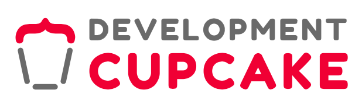
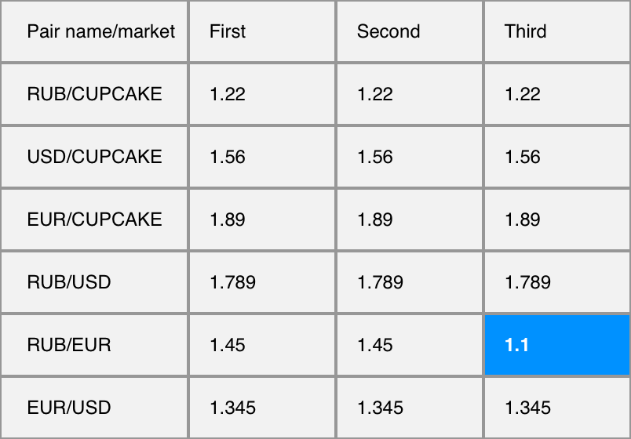

## Тестовое задание на позицию фронтенд разработчика в комманду cupcake development

## Задание

Необходимо в реальном времени отображать значение валютных пар RUB/CUPCAKE, USD/CUPCAKE, EUR/CUPCAKE, RUB/USD, RUB/EUR, EUR/RUB. Эндпоинт */poll резолвится в тот момент когда появляются новые данные, смотри - лонг поллинг. Так же необходимо подсветить самые выгодные(наименьшее значение по строке). В качестве фронтенд фреймворка необходимо использовать React. Другие библиотеки для работы с данными - на Ваше усмотрение.  

После развертывания документация будет доступна по адресу http://localhost:3000




Результатом выполненного тестового задания должен быть репозиторий с кодом.

## Deployment
```
docker-compose up
```

## Installation

```bash
$ yarn install
```

## Running the app

```bash
#build
$ yarn build

# development
$ yarn start

# watch mode
$ yarn start:dev

# production mode
$ yarn start:prod
```
